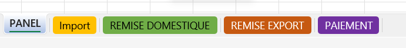
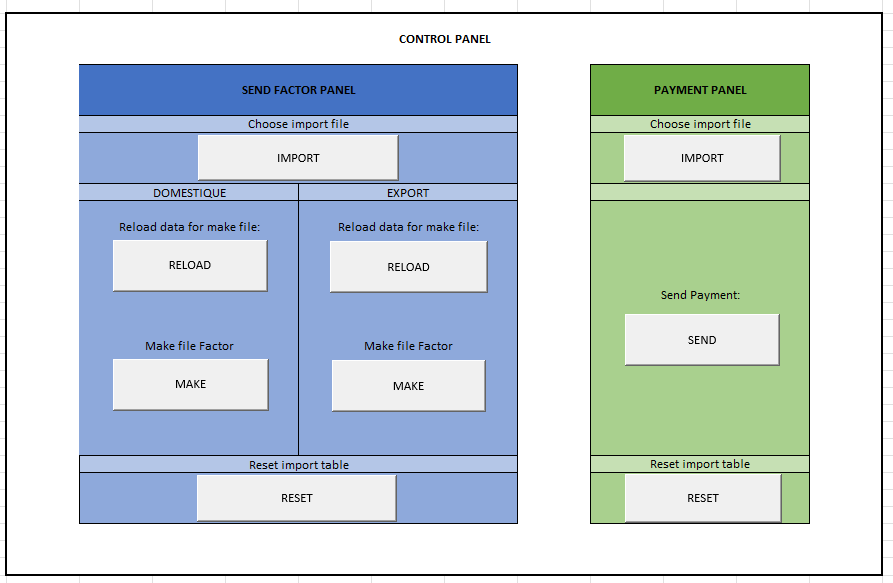
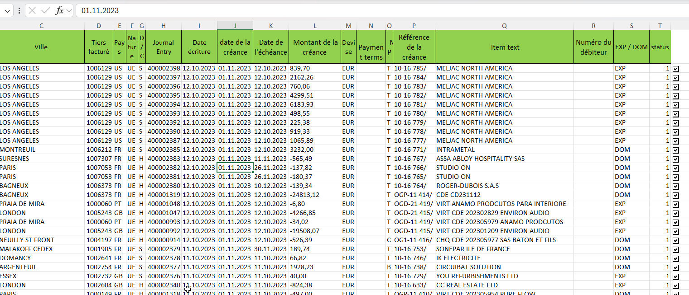
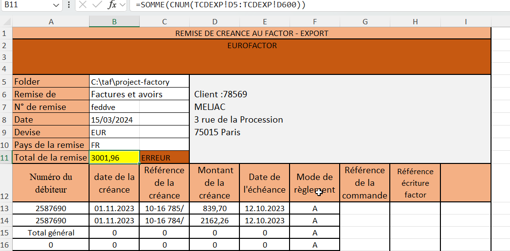
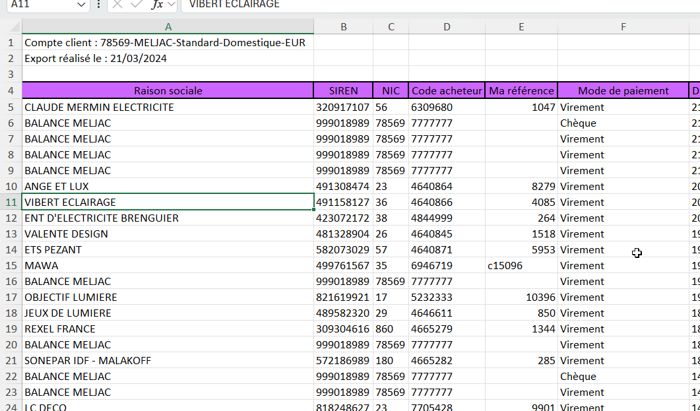

 
  
 
 
Mode Opératoire
 
Cession de créance factor
 
 

 
  

Ce document décrit les étapes à suivre pour utiliser l’application de cession de créances factor.

### 1 - Description Générale du Processus

La cession de créance factor permet de céder des créances à une société spécialisée, le factor, afin d’obtenir une avance de trésorerie. Cette application facilite ce processus en automatisant la saisie des informations nécessaires, la génération de documents et le suivi du statut de chaque opération.

Le processus débute avec l’ouverture du fichier `FACTOR_TEMPLATE.xlsm`, qui contient les modèles de documents nécessaires. Vous y saisirez les informations de cession de créance et générerez les documents requis.

### 2 - Ouverture du Fichier FACTOR_TEMPLATES.xlsm

Ouvrez le fichier FACTOR_TEMPLATES.xlsm.

L'aplcation se compose de plusieurs onglets, dont `PANEL`, `IMPORT`, `REMISE DOMESTIQUE`,  `REMISE EXPORT`, `PAIEMENT`.

Accédez aux onglets `remises` pour renseigner les champs suivants :

- `Dossier de remise factor` (repertoire du fichier de cession de créance)
- `Numéro du client`
- `Numéro de la remise`
- `Date de la remise`
- `Devise de la remise`
- `Pays de la remise`

### 3- Description des Onglets

#### 3.1 - Onglet PANEL

L’onglet `PANEL` contient les boutons pour piloter l’application. Vous y trouverez les options pour accéder aux différentes fonctionnalités.

#### 3.2 - Onglet IMPORT

L’onglet `IMPORT` permet de sélectionner et visualiser les données à envoyer en cession de créance factor. Cochez les cases des données à transmettre.

#### 3.3 - Onglets REMISES (Domestique/Export)

Ces onglets contiennent un récapitulatif des données de remise et des informations sur les transactions. Vous pouvez aussi y visualiser les numéros d'écritures générées dans SAP.

#### 3.4 - Onglet PAIEMENT

L’onglet `PAIEMENT` permet de visualiser les données de paiement factor. Vous pouvez y vérifier les informations avant de les envoyer en paiement.

### 4 - Utilisation des Boutons dans l'Onglet PANEL

L'onglet `PANEL` est divisé en deux sections :

**REMISES** pour gérer les remises factor

- Utilisez les boutons dans cet ordre :
    - [**IMPORT**](#51---bouton-import-remise)
    - [**RELOAD**](#53---bouton-reload-remise)
    - [**MAKE**](#54---bouton-make-remise)
    - [**RESET**](#54---bouton-reset-remise) (si nécessaire)

**PAIEMENTS** pour gérer les paiements factor

- Utilisez les boutons dans cet ordre :
    - [**IMPORT**](#55---bouton-import-paiement)
    - [**SEND**](#56---bouton-send-paiement)
    - [**RESET**](#57---bouton-reset-paiement) (si nécessaire)

⚠️ Attention : Respectez l'ordre d'utilisation des boutons pour assurer le bon fonctionnement.

### 5 - Détails des Boutons

#### 5.1 - BOUTON IMPORT (REMISE)

Ce bouton permet d’importer les données de cession de créance factor depuis un fichier CSV. Vérifiez les données dans l’onglet IMPORT après l’importation.

⚠️ Attention : Importez uniquement des fichiers au format CSV.

### 5.2 - BOUTON RELOAD (REMISE)

Recharge les données dans les onglets de remises après la sélection des données dans l’onglet IMPORT.

⚠️ Attention : N’utilisez pas ce bouton avant l’importation.

### 5.3 - BOUTON MAKE (REMISE)

Génère les documents finaux de la cession et enregistre les écritures dans SAP. Un message de confirmation avec le nom du fichier et les numéros d’écriture apparaît si tout s’est bien passé.

⚠️ Attention : Vérifiez les données et les champs obligatoires avant de cliquer.

### 5.4 - BOUTON RESET (REMISE)

Réinitialise les données de l’onglet IMPORT pour recommencer le processus.

⚠️ Attention : Assurez-vous qu’il n’y a pas de données en attente dans la colonne « Référence écriture factor » avant de cliquer.

### 5.5 - BOUTON IMPORT (PAIEMENT)

Importe les données nécessaires au paiement factor. Vérifiez dans l’onglet PAIEMENT une fois l’importation terminée.

⚠️ Attention : Importez uniquement des fichiers CSV.

### 5.6 - BOUTON SEND (PAIEMENT)

Enregistre les écritures de paiement dans SAP. Une fois validé, les lignes traitées passent au vert.

### 5.7 - BOUTON RESET (PAIEMENT)

Réinitialise les données de l’onglet PAIEMENT pour redémarrer le processus.

⚠️ Attention : Vérifiez qu'il n'y a pas de données en attente dans la colonne « Référence paiement factor » avant de cliquer.
